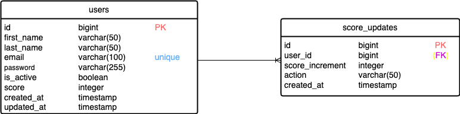
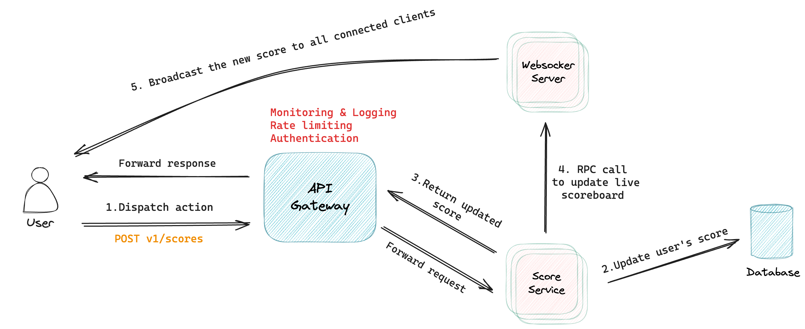

# Scoreboard API Service

## 🚀 Requirement Analysis

### Functional Requirements

1.  **Update Scores**: The backend must provide an API endpoint to update a user's score when a specific action is completed , verifies the user's identity, and ensures the request is authorized to prevent malicious updates.

2.  **Top 10 Scores Display**: The backend must provide an API endpoint to retrieve the top 10 highest scores, which will be displayed in real-time on the frontend scoreboard.

3.  **Live Updates**: The backend must propagate real-time updates to the frontend whenever a user's score is changed.

### Non-Functional Requirements

1. **Scalability**: The system should be designed to handle an increasing number of users and requests, using caching for frequently accessed data like top scores and optimizing the database schema for fast reads and writes.

2. **Performance**: The API must respond quickly to maintain a smooth user experience, especially during live updates, by optimizing database queries and indexing to accelerate sorting and ranking operations for retrieving top scores.

3. **Consistency**: The system must ensure that data remains consistent across all components, particularly when updating scores

## 🚀 Data Model Design

  

## 🚀 Data Model Design

### **1. `users`**

The `users` table will store the information of the users, including their score, which can be updated when they complete actions that trigger a score change.

    CREATE TABLE "users" (
      "id" BIGINT PRIMARY KEY GENERATED ALWAYS AS IDENTITY (START WITH 1 INCREMENT BY 1),  -- Unique user identifier with BIGINT type
      "first_name" VARCHAR(50) NOT NULL,           -- User's first name (VARCHAR with length 50)
      "last_name" VARCHAR(50) NOT NULL,            -- User's last name (VARCHAR with length 50)
      "email" VARCHAR(50) NOT NULL UNIQUE,         -- User's email (unique constraint, VARCHAR with length 50)
      "is_active" BOOLEAN NOT NULL DEFAULT TRUE,   -- Whether the user is active
      "score" BIGINT DEFAULT 0,                    -- Current score (BIGINT for large score values)
      "created_at" TIMESTAMP WITH TIME ZONE DEFAULT now(),  -- Account creation timestamp
      "updated_at" TIMESTAMP WITH TIME ZONE DEFAULT now()   -- Last update timestamp
    );

- `id`: The unique identifier for each score update (generated automatically as a `BIGINT`).
- `user_id`: The foreign key linking to the `users` table to track which user performed the action.
- `score_increment`: The amount by which the user's score increases.
- `action`: A description of the action (e.g., completing a specific task).
- `created_at`: Timestamp indicating when the score update occurred.

### **2. `score_updates`**

This table logs all score changes to provide a history of user actions that affect scores. It can be used to audit or track score changes over time.

    CREATE TABLE "score_updates" (
      "id" BIGINT PRIMARY KEY GENERATED ALWAYS AS IDENTITY (START WITH 1 INCREMENT BY 1),  -- Unique score update identifier with BIGINT type
      "user_id" BIGINT REFERENCES "users"(id) ON DELETE CASCADE,  -- Foreign key to users table with BIGINT type
      "score_increment" BIGINT NOT NULL,                          -- Amount by which the score increased
      "action" VARCHAR(100) NOT NULL,                             -- Description of the action (e.g., "Completed Challenge 1")
      "created_at" TIMESTAMP WITH TIME ZONE DEFAULT now(),        -- Timestamp when the score update occurred
      CONSTRAINT "score_update_user_id_fkey" FOREIGN KEY ("user_id") REFERENCES "users"("id")
    );

- `id`: The unique identifier for each score update (generated automatically as a `BIGINT`).
- `user_id`: The foreign key linking to the `users` table to track which user performed the action.
- `score_increment`: The amount by which the user's score increases.
- `action`: A description of the action (e.g., completing a specific task).
- `created_at`: Timestamp indicating when the score update occurred.

### **3. Indexes for Performance Optimization**

To enhance the performance of score retrieval and sorting, particularly when querying the top scores, we should create indexes.

    -- Index to optimize queries for sorting users by their score
    CREATE INDEX "idx_users_score" ON "users"("score");

    -- Index on "user_id" in "score_updates" to speed up searches by user
    CREATE INDEX "idx_score_updates_user_id" ON "score_updates"("user_id");

    -- Index on "created_at" in "score_updates" to allow sorting by action time (useful if you want to fetch recent updates)
    CREATE INDEX "idx_score_updates_created_at" ON "score_updates"("created_at");

These indexes help to speed up:

- Queries that retrieve the top scores.
- Queries that join `users` with `score_updates`.
- Sorting by `created_at` for retrieving the most recent score updates.

## 🚀 APIs Design

### **1. User Authentication (Login)**

- **Endpoint**: `/v1/auth/login`
- **Method**: `POST`
- **Description**: Authenticates the user and provides a JWT token for subsequent API requests.

**Request Body (JSON):**

    {
      "email": "john.doe@example.com",
      "password": "userpassword"
    }

#### **Validation**:

- `email`: Required, must be a valid email format.
- `password`: Required, must not be empty.

**Response**:

- **Success (200)**: Returns the JWT token and the user details.

      {
      "status": "success",
      "message": "Login successful",
      "data": {
        "token": "jwt_token_here",
        "user": {
          "id": 123,
          "first_name": "John",
          "last_name": "Doe",
          "email": "john.doe@example.com",
          "score": 110,
          "is_active": true,
          "created_at": "2025-02-23T12:00:00Z",
          "updated_at": "2025-02-23T12:00:00Z"
        }
      }

- **Error (400)**: Bad Request, validation failure (e.g., missing email or password).
- **Error (401)**: Unauthorized (incorrect credentials).
- **Error (500)**: Internal Server Error (unexpected authentication failures, such as database errors or server issues).

### **2. Update User Score**

- **Endpoint**: `/v1/scores`
- **Method**: `POST`
- **Description**: Updates a user's score when they complete an action. This is where the score increment will be added based on user actions.

**Request Header**:

    Authorization: Bearer {jwt_token}

**Request Body (JSON):**

    {
      "user_id": 123,
      "score_increment": 10,
      "action": "Completed Challenge 1"
    }

#### **Validation**:

- `user_id`: Must be a valid integer corresponding to a user in the database.
- `score_increment`: Required, must be a valid integer greater than 0 (no negative or zero values).
- `action`: Required, must not be empty.

  **Response**:

- **Success (200)**: The score has been updated successfully.

      {
      "status": "success",
      "message": "Score updated successfully",
      "data": {
        "user_id": 123,
        "score": 110
        }
      }

- **Error (400)**: Bad Request (invalid score increment or missing parameters).
- **Error (401)**: Unauthorized (invalid or missing token).
- **Error (403)**: Forbidden (attempting to modify another user's score).
- **Error (404)**: Not Found (user does not exist).
- **Error (429)**: Too Many Requests (user has exceeded the rate limit for score updates).
- **Error (500)**: Internal Server Error (unexpected authentication failures, such as database errors or server issues).

### **3. Get Top 10 Scores**

- **Endpoint**: `/v1/scores/top10`
- **Method**: `GET`
- **Description**: Retrieves the top 10 users with the highest scores.

**Request Header**:

    Authorization: Bearer {jwt_token}

**Response**:

- **Success (200)**: Returns the top 10 users with the highest scores.

       {
      "status": "success",
      "message": "Top 10 scores retrieved successfully",
      "data": [
        {
          "id": 1,
          "first_name": "John",
          "last_name": "Doe",
          "score": 500
        },
        {
          "id": 2,
          "first_name": "Jane",
          "last_name": "Smith",
          "score": 450
        },
        ...
      ]

  }

- **Error (401)**: Unauthorized (invalid or missing token).
- **Error (500)**: Internal Server Error (unexpected authentication failures, such as database errors or server issues).

### ⚠️ **Error response format**

    {
      "status": "error",
      "error": {
        "code": "ERROR_CODE",
        "message": "error message",
        "cause": "cause message",
        "backtrace": "backtrace info" # only shown in development environment
      }
    }

### ✅ Performance Optimization

#### 1. Caching the Top 10 Scores

Since the **Top 10 scores** are frequently queried but not updated often, caching this data will improve the performance of the `/v1/scores/top10` API.

#### **Strategy**:

- Cache the **Top 10 Scores** list in a fast-access store like **Redis**.
- Set an appropriate expiration time for the cache (e.g., 30 seconds or 1 minute).
- When a score update happens, invalidate the cache and recalculate the Top 10 list if needed.

#### 2. Rate Limiting Strategy for Update Score API

The goal is to **limit the number of score updates** a user can make within a specified time period to prevent abuse and ensure fair usage of the scoring system. These are keys points:

- **Key**: The key used in Redis to track each user’s score update attempts is `user:{userId}:score_update_count`. This uniquely identifies the user's requests.
- **TTL**: The TTL (Time to Live) is set to the rate limit window (e.g., 60 seconds). After the TTL expires, the request count will be reset for the next window.
- **Increment**: Every time a user attempts to update their score, the request count is incremented in Redis.
- **Expiration**: The request count is set to expire after the window duration (e.g., 1 minute), ensuring that the rate limit resets after each time window.
- **Error Handling**: If the rate limit is exceeded, we return a **429 Too Many Requests** error, and if any unexpected error occurs, we return a **500 Internal Server Error**.

## 🐳 Detailed Design - Update User Score & Live Update Of The Score Board

  

